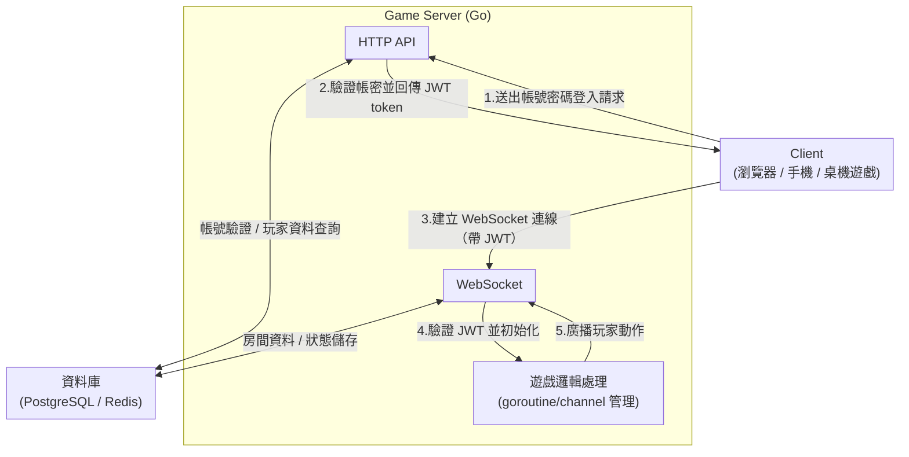

# game server (Go)

```mermaid
flowchart TD
    subgraph Client["Client
    (瀏覽器 / 手機 / 桌機遊戲)"]
    end

    subgraph GameServer["Game Server (Go)"]
        subgraph HTTP["HTTP API"]
        end
        subgraph WS["WebSocket"]
        end
        GameLogic["遊戲邏輯處理
        (goroutine/channel 管理)"]
    end

    subgraph DB["資料庫
    (PostgreSQL / Redis)"]
    end

    Client -->|1.送出帳號密碼登入請求| HTTP
    HTTP -->|2.驗證帳密並回傳 JWT token| Client
    Client -->|3.建立 WebSocket 連線（帶 JWT）| WS
    WS -->|4.驗證 JWT 並初始化| GameLogic
    GameLogic -->|5.廣播玩家動作| WS

    HTTP <-->|帳號驗證 / 玩家資料查詢| DB
    WS <-->|房間資料 / 狀態儲存| DB
```